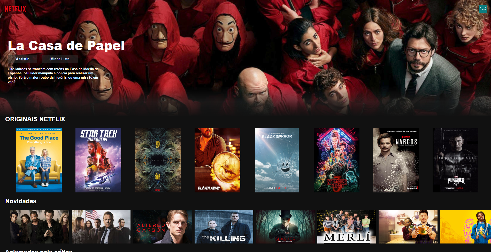
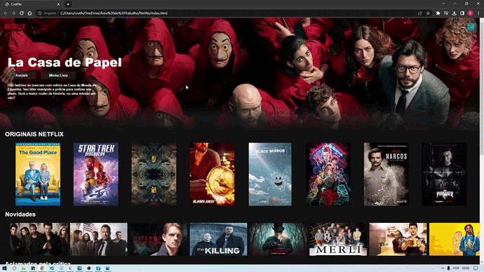

# Cópia Netflix

Após algum tempo focando no Back End com PHP, criei esse projeto para não perder a prática com HTML, CSS e JS.

Site com layout agradável, intuitivo e responsivo.

Posteriormente, pretendo compartilhar códigos mais complexos, utilizando outras ferramentas.

 

 

